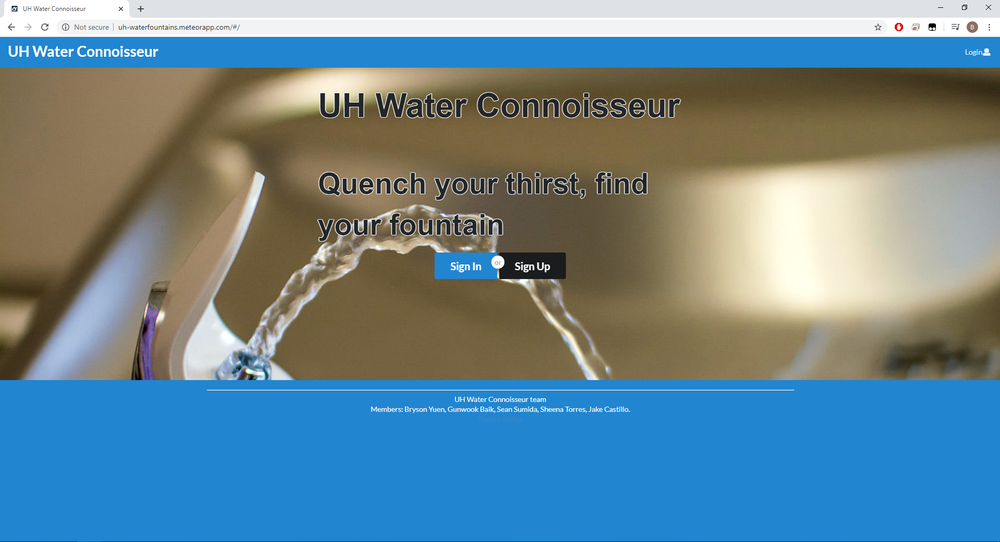
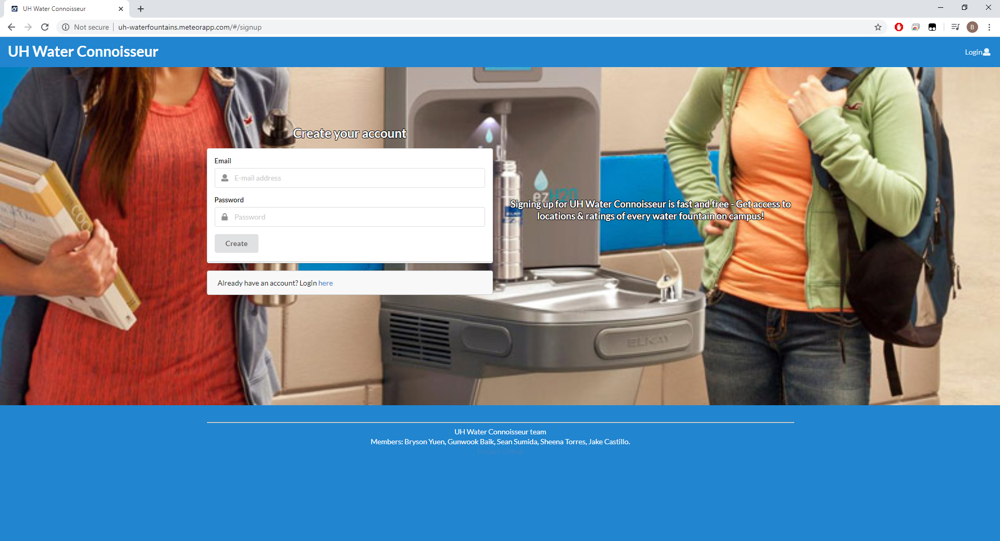
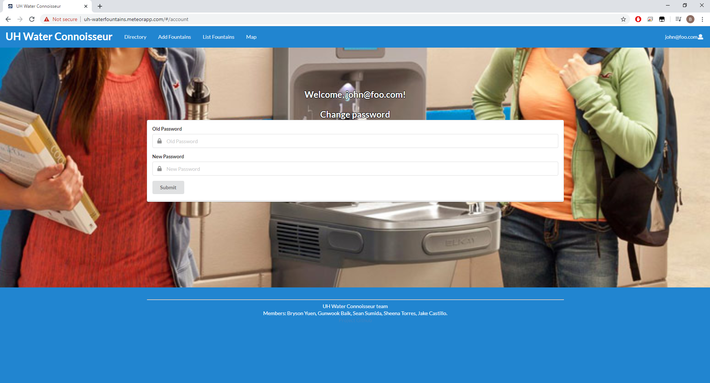
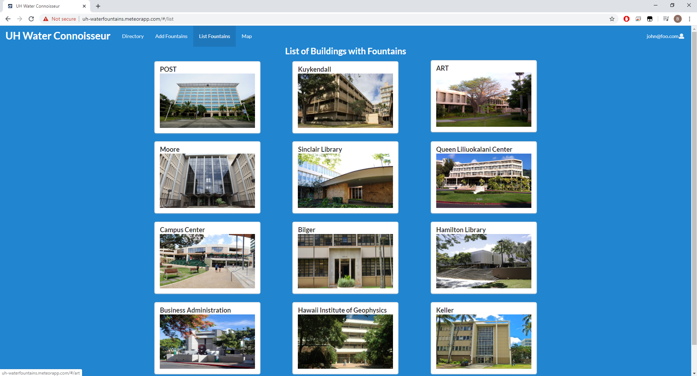
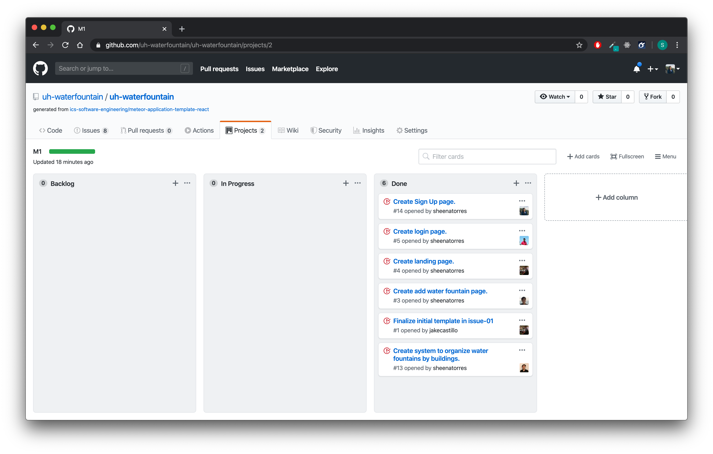

## Table of contents

* [Overview](#overview)
* [GitHub Organization](#github-organization)
* [Galaxy](#galaxy)
* [User Guide](#user-guide)
* [Community Feedback](#community-feedback)
* [Developer Guide](#developer-guide)
* [Development History](#development-history)
* [Contact Us](#contact-us)

## Overview

*The Problem*: With many thirsty people frequenting the UH Manoa Campus to quench their thirst, it is imperative that people have access to the best avaliable water source on campus. For all those times you don’t have a water bottle and aren’t willing to pay the price for bottled water. Or maybe you aren’t sure if the water fountains in POST are better then the water fountains at Sakamaki. We bring to you an innovative new app.

*The Solution*: Introducing Water Connoisseur, for the times you don’t have a water bottle and just need to know which water fountain is the best. Water Connoisseur is an app that allows users to review and find the best water fountains on campus.

For this app, there will be a way to organize and present different water fountains around the UH Manoa campus. There will be two roles, Users, who can login to review water fountains and submit requests to have water fountains added to the list of reviewable water fountains. Admins, who will be able to login and moderate the app as well as add water fountains to the reviewable list.

Users should also be able to rate other users reviews, with a like and dislike system. With inappropriate reviews being able to be removed by Admins.

There should also be a sorting system, with top rated water fountains being able to be found easily.

## GitHub Organization
Access the UH Water Fountains GitHub Organization [here](https://github.com/uh-waterfountain), and all of its repositories.

## Galaxy
The UH Water Fountains system is deployed to Galaxy, and can be accessed [here](http://uh-waterfountains.meteorapp.com/#/).

## User Guide

### Landing Page
The Landing Page is the first page users will see.



### Login and Sign Up
These pages are for signing up if you do not own an account or to login if you have an account.

Login Page


Sign Up Page


### Directory
Once you have signed in, you should be able to view the Directory. It is similar to the landing page, but you are logged into your account and now have access to the features of the application.


### Account Management
When signed in, there is now an Account Management option in the dropdown at the top right. Here you are able to change account settings.



### Add Fountain Page
On the NavBar, there is an Add Fountains link that will direct you to a form where you are able to add a fountain that is on campus. 


### List Buildings Page
On the NavBar, there is a List Buildings link that will direct you to a list of buildings on campus, by clicking one of these cards it will display all the registered water fountains in the building.



### List Fountains Page
After clicking a building card you will be shown the fountains that can be found in that building. With each fountain being reviewable here by clicking on the ratings from 1 to 5 stars.
The image below is an example of the Post List Fountains Page.


### Admin Fountain List
Users who are desginated with the "admin" role will be able to see a Fountain List which contains all the fountains, here you can also click on the edit button to edit any fountain as well as accept any fountains that are requested to be added.


### Admin Edit Page
After clicking on the edit button for a fountain on the admin list page you will be sent to the Admin Edit Page. Here you can edit the fountain and also accept fountains which have not been approved of yet.


### Map Page
The Map Page provides a map of the UH Manoa campus. The map is labeled with the names of the buildings that are included in the List Fountains page. It also consists information that shows the amount of fountains in each building.


## Community Feedback
For user feedback we were able to gather feedback from 5 UH community members. From this we were able to gather how users felt about our system in order for us to improve our application.

Overall, users were able to understand most of the sites user interface without problems, though there were some issues with the naming conventions that we used for some things. For instance on the add fountain page there is a "Location" section that must be filled, though we could have instead named that section "Building" in order to give users a clearer idea of what the section was referring to.

We also received feedback on the design of some pages, as some pages looked very plain for users. With there being a lot of blank space on some of the fountain pages. Users also wanted some extra features for the fountains, such as the ability to add comments for fountains in order to have brief descriptions of each fountain. Also, a logo was suggested instead of the plain text used on the top left of our nav bar.

Another thing a user suggested was the addition of a personal fountain page in order to have a list of personal favorite fountains that would be accessible to only the user. But due to time constraints this was not added. 

## Developer Guide
This section provides information of interest to Meteor developers wishing to use this code base as a basis for their own development tasks.

### Installation 
1. Install [Meteor.](https://www.meteor.com/install)

2. Visit the [UH Water Fountain's application Github page.](https://github.com/uh-waterfountain/uh-waterfountain) You can either click the “Use this template” button, download the source code as a zip file, or make a fork of the repository to create your own repository initialized with a copy of this application.
  
    However way you do it, clone your copy of the repository into your local computer.
    
3. Then, cd into the uh-waterfountain/app directory and install libraries by:

    ```
    $ meteor npm install
    ```    

4. Run the system with:

    ```
    $ meteor npm run start
    ```
    
5. You can now view the application at [http://localhost:3000](http://localhost:3000).
    
### Initialization

The [config](https://github.com/uh-waterfountain/uh-waterfountain/tree/master/config) directory holds settings files. The repository contains one file: config/settings.development.json.

The file contains default definitions for default accounts and default fountains.

### Quality Assurance

#### ESLint

UH Waterfountains includes a [.eslintrc](https://github.com/uh-waterfountain/uh-waterfountain/blob/master/app/.eslintrc) file to define the coding standards that is adhered to the applications. ESlint can be evoked from the command line:

```
meteor npm run lint
```

ESLint should then run without generating any errors.

## Development History

### Milestone 1: Mockup Development
The goal of Milestone 1 was to create a set of HTML pages providing a mockup of the pages in the system.

Milestone 1 was managed using [UH Water Fountain Github Project Board M1:](https://github.com/uh-waterfountain/uh-waterfountain/projects/2)



### Milestone 2: Improving Functionality and Quality
The goal of Milestone 2 was to improve the functionality and quality of our application beyond Milestone 1.

Milestone 2 was managed using [UH Water Fountain Github Project Board M2:](https://github.com/uh-waterfountain/uh-waterfountain/projects/3) 


### Milestone 3: Final Touches
The goal of Milestone 3 was to clean up the code base and fix minor UI issues.

Milestone 3 is currently being managed using [UH Water Fountain Github Project Board M3:](https://github.com/uh-waterfountain/uh-waterfountain/projects/4)


## Contact Us
* [Bryson Yuen](https://github.com/brysonsy)
* [Gunwook Baik](https://github.com/gbaik00)
* [Sean Sumida](https://github.com/seansumida)
* [Sheena Torres](https://github.com/sheenatorres)
* [Jake Castillo](https://github.com/jakecastillo)
